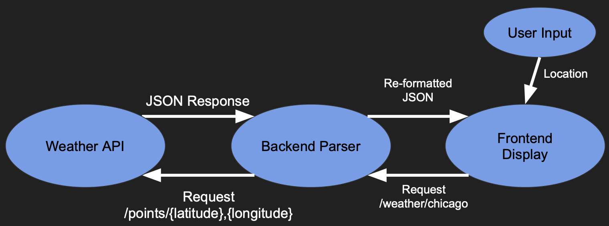

# WeatherWise
Get the current weather, anywhere, anytime!

WeatherWise helps you make wise weather decisions by providing you with suggestions for the day ahead, 
and showing you related impacts of climate change across the globe. 

This app is built using React and data from the National Weather Service. To access current location, make sure that location privleges are allowed. Otherwise, enter a location within the United States to view its weather. 

# Technical Architecture

# Member Roles
Eeshan Garr: Backend and server development

Eli Gidron: Connecting backend and frontend, some graphic design

Timothy Gonzalez: Frontend UI, data structures 
# Development
Please see [DEVELOPMENT.md](DEVELOPMENT.md) for setup instructions.
